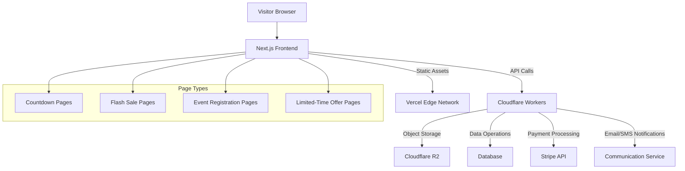
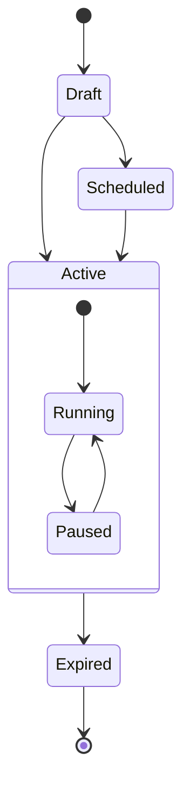

# Temporary Pages Platform: System Architecture

## Overview

The Temporary Pages Platform is designed as a modern, serverless architecture leveraging Next.js for the frontend and Cloudflare's edge computing solutions for backend services. This document outlines the architectural components, their interactions, and the design decisions made to support the platform's core features.

## System Components

### Frontend Architecture (Next.js 15)

- **Client-Side Rendering**: For dynamic user interfaces in the user console
- **Static Site Generation (SSG)**: For landing pages and marketing content
- **Server-Side Rendering (SSR)**: For dynamic temporary pages with real-time availability checks
- **Incremental Static Regeneration (ISR)**: For semi-dynamic content that changes infrequently

### Backend Architecture (Cloudflare Workers)

- **Modular Monolith Approach**: A single worker with modular internal organization rather than separate microservices
- **Domain-Driven Modules**: Organized into distinct functional modules:
  - `auth`: User authentication and authorization
  - `pages`: Page creation, management, and delivery
  - `products`: Digital product handling
  - `payments`: Stripe integration and transaction processing
  - `storage`: File upload and secure delivery
  - `analytics`: Usage and performance tracking
- **Shared Core Services**: Common utilities and middleware used across modules:
  - Security (HMAC, rate limiting)
  - Logging and monitoring
  - Error handling
  - Database adapters

- **Workers KV**: For fast access to frequently accessed metadata and configuration
- **Durable Objects**: For managing state that requires strong consistency (e.g., download counts, registration counts)

#### Rationale for Modular Monolith vs. Microservices

The platform employs a modular monolith approach for the following reasons:
- **Simplified Deployment**: Single worker deployment reduces operational complexity
- **Reduced Cold Starts**: Avoids multiple cold starts across separate workers
- **Lower Latency**: Eliminates cross-worker communication overhead
- **Cost Efficiency**: More economical use of Cloudflare Worker resources
- **Future Flexibility**: Modular design allows extraction into separate workers if needed later

### Data Storage

- **Cloudflare R2**: Object storage for digital products (PDFs, images, etc.)
- **Cloudflare D1**: For structured data storage (user accounts, page configurations, etc.)
  - Separation of read and write models for scalability

### Authentication & Security

- **Auth Layer**: JWT-based authentication with configurable session expiration
- **HMAC Signing**: For tamper-proof URLs and parameters
- **Rate Limiting**: Implemented at the edge level with Cloudflare Workers
- **IP Validation**: Using CF-Connecting-IP headers for access control

## System Integration

## Request Flow

### Page Creation

1. User creates a temporary page through the console frontend
2. Selects page type (countdown, flash sale, event registration, limited-time offer)
3. Configures page-specific settings and customizations
4. For product-based pages, associates products or uploads new products
5. Next.js API routes process configuration and generate a unique shortened UUID
6. Any files are uploaded directly to R2 with presigned URL
7. Page metadata stored in database with expiration parameters
8. For product-based pages, PAGE_CONTENT records are created with references to the associated products
9. Unique page URL generated and returned to user

### Page Visitor Flow

#### Countdown Landing Page
1. Visitor accesses the countdown page URL
2. Server validates page status (active, expired, not yet launched)
3. If active, renders the countdown timer synced via WebSocket/SSE
4. Processes any email/SMS registrations for notifications
5. After countdown reaches zero, performs configured action (redirect, show message, etc.)

#### Flash Sale Page
1. Visitor accesses the flash sale URL
2. Server validates sale status and remaining time
3. If active, displays products with discounted prices and countdown
4. Customer initiates checkout via Stripe Checkout
5. On successful payment, generates download links or fulfillment information
6. When sale ends, page automatically switches to expired state

#### Event Registration Page
1. Visitor accesses the event registration URL
2. Server validates registration status (open, closed, waitlist)
3. Visitor completes registration form
4. System processes registration and sends confirmation
5. As event approaches, automated reminders are sent
6. After event concludes, page shows post-event content

#### Limited-Time Offer Page
1. Visitor accesses the limited offer URL
2. Server validates offer status and remaining time/quantity
3. Displays offer details with countdown and discount code
4. Visitor can copy code or proceed directly to purchase
5. After expiration, redirects to configured destination

## Page Lifecycle Management

### Lifecycle States
- **Draft**: Page configuration in progress
- **Scheduled**: Page configured but not yet launched
- **Active**: Page is live and accessible
  - **Running**: Actively accepting visitors/orders/registrations
  - **Paused**: Temporarily paused but not expired
- **Expired**: Page has reached its expiration time or limit

## Security Architecture

### URL Security

- All generated URLs contain a timestamp and HMAC signature
- Signatures are verified at the edge before processing requests
- Parameters cannot be tampered with without detection

### File Access Control

1. Files in R2 have no public access
2. Access requires signed URLs generated at the edge
3. URLs include:
   - Time-based expiration
   - IP binding
   - Rate limiting parameters

### Anti-Abuse Measures

- Rate limiting on sensitive endpoints
- Browser fingerprinting for suspicious activity detection
- Cloudflare's built-in DDoS protection
- Captcha for registration forms to prevent spam

## Real-Time Features

### WebSocket/SSE Integration

- **Countdown Synchronization**: Server-synced countdown timers to prevent client-side manipulation
- **Inventory Updates**: Real-time inventory level updates for limited quantity offers
- **Registration Counters**: Live attendee/registration counts for social proof
- **Price Changes**: Ability to update pricing in real-time for flash sales

## Scalability Considerations

- Edge caching for page metadata
- Horizontal scaling through serverless architecture
- Separation of read and write paths
- Asynchronous processing for non-critical operations
- Optimized database access patterns for high-traffic periods
- **Selective Extraction Strategy**: Design modules to be extractable into separate workers if specific components need independent scaling

## Monitoring and Observability

- Cloudflare Analytics for edge function performance
- Custom metrics collection for business KPIs
- Error tracking and alerting via Sentry or similar service
- Real-time dashboard for active pages and conversion metrics

## Deployment Strategy

- CI/CD pipeline via GitHub Actions
- Separate staging and production environments
- Feature flags for gradual rollout of new capabilities
- Blue-green deployments for zero-downtime updates
- Module-based testing to ensure isolated components work correctly

## Future Architecture Expansion

- Extraction of high-load modules into dedicated workers if needed
- WebSocket integration for real-time collaborative features
- Multi-region database strategy for global expansion
- Event-driven architecture for complex workflows
- Integration with additional payment processors beyond Stripe
- Advanced analytics with machine learning for conversion optimization