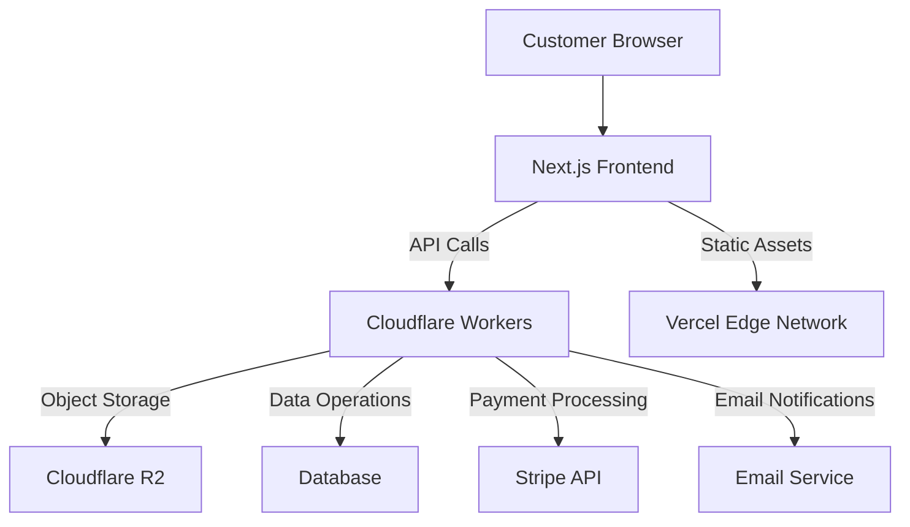

# Temporary Pages Platform: System Architecture

## Overview

The Temporary Pages Platform is designed as a modern, serverless architecture leveraging Next.js for the frontend and Cloudflare's edge computing solutions for backend services. This document outlines the architectural components, their interactions, and the design decisions made to support the platform's core features.

## System Components

### Frontend Architecture (Next.js 15)

- **Client-Side Rendering**: For dynamic user interfaces in the creator console
- **Static Site Generation (SSG)**: For landing pages and marketing content
- **Server-Side Rendering (SSR)**: For dynamic sales pages with real-time availability checks
- **Incremental Static Regeneration (ISR)**: For semi-dynamic content that changes infrequently

### Backend Architecture (Cloudflare Workers)

- **Edge Functions**: Serverless JavaScript executed at Cloudflare's edge locations
- **Workers KV**: For fast access to frequently accessed metadata and configuration
- **Durable Objects**: For managing state that requires strong consistency (e.g., download counts)

### Data Storage

- **Cloudflare R2**: Object storage for digital products (PDFs, images, etc.)
- **Database Layer**: For structured data storage (user accounts, sales records, etc.)
  - Options include: Cloudflare D1, Prisma with PlanetScale, or Supabase
  - Separation of read and write models for scalability

### Authentication & Security

- **Auth Layer**: JWT-based authentication with configurable session expiration
- **HMAC Signing**: For tamper-proof URLs and parameters
- **Rate Limiting**: Implemented at the edge level with Cloudflare Workers
- **IP Validation**: Using CF-Connecting-IP headers for access control

## System Integration

## Request Flow

### Sales Page Generation

1. Creator uploads product through console frontend
2. Next.js API routes process metadata and generate a unique shortened UUID
3. File is uploaded directly to R2 with presigned URL
4. Metadata stored in database with expiration parameters
5. Unique sales page URL generated and returned to creator

### Customer Purchase Flow

1. Customer visits unique sales page URL
2. Server validates page expiration status before rendering
3. Customer initiates checkout via Stripe Checkout
4. On successful payment, Cloudflare Worker generates a signed download URL
5. Download URL is time-limited and IP-restricted
6. Customer receives access to digital product

## Security Architecture

### URL Security

- All generated URLs contain a timestamp and HMAC signature
- Signatures are verified at the edge before processing requests
- Parameters cannot be tampered with without detection

### File Access Control

1. Files in R2 have no public access
2. Access requires signed URLs generated at the edge
3. URLs include:
   - Time-based expiration
   - IP binding
   - Rate limiting parameters

### Anti-Abuse Measures

- Rate limiting on sensitive endpoints
- Browser fingerprinting for suspicious activity detection
- Cloudflare's built-in DDoS protection

## Scalability Considerations

- Edge caching for sales page metadata
- Horizontal scaling through serverless architecture
- Separation of read and write paths
- Asynchronous processing for non-critical operations

## Monitoring and Observability

- Cloudflare Analytics for edge function performance
- Custom metrics collection for business KPIs
- Error tracking and alerting via Sentry or similar service

## Deployment Strategy

- CI/CD pipeline via GitHub Actions
- Separate staging and production environments
- Feature flags for gradual rollout of new capabilities
- Blue-green deployments for zero-downtime updates

## Future Architecture Expansion

- WebSocket integration for real-time features
- Multi-region database strategy for global expansion
- Event-driven architecture for complex workflows
- Integration with additional payment processors beyond Stripe