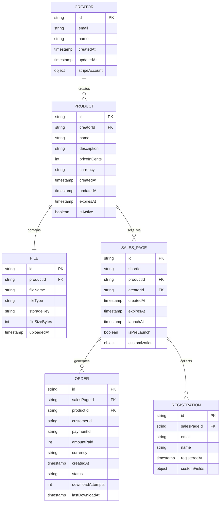

# Temporary Pages Platform: Data Model

## Overview

This document outlines the core data structures, relationships, and storage solutions used in the Temporary Pages Platform. The data model is designed to support the platform's key features while maintaining scalability, security, and performance.

## Entity Relationship Diagram



## Core Entities

### Creator

Represents platform users who create and sell digital products.

| Field | Type | Description |
|-------|------|-------------|
| id | UUID | Primary identifier |
| email | String | Email address, used for login |
| name | String | Display name |
| createdAt | Timestamp | Account creation date |
| updatedAt | Timestamp | Last account update |
| stripeAccount | Object | Stripe Connect account details |

### Product

Digital items that creators upload and sell through the platform.

| Field | Type | Description |
|-------|------|-------------|
| id | UUID | Primary identifier |
| creatorId | UUID (FK) | Reference to creator |
| name | String | Product name |
| description | String | Product details |
| priceInCents | Integer | Price in smallest currency unit |
| currency | String | ISO currency code (e.g., USD) |
| createdAt | Timestamp | Creation date |
| updatedAt | Timestamp | Last update date |
| expiresAt | Timestamp | Automatic expiration date |
| isActive | Boolean | Whether product is available |

### File

Represents the actual digital asset being sold.

| Field | Type | Description |
|-------|------|-------------|
| id | UUID | Primary identifier |
| productId | UUID (FK) | Reference to product |
| fileName | String | Original file name |
| fileType | String | MIME type |
| storageKey | String | R2 object key |
| fileSizeBytes | Integer | File size |
| uploadedAt | Timestamp | Upload date |

### Sales Page

A temporary page that sells one or more products.

| Field | Type | Description |
|-------|------|-------------|
| id | UUID | Primary identifier |
| shortId | String | Short URL identifier |
| productId | UUID (FK) | Reference to product |
| creatorId | UUID (FK) | Reference to creator |
| createdAt | Timestamp | Creation date |
| expiresAt | Timestamp | Expiration date/time |
| launchAt | Timestamp | Launch date for pre-launch pages |
| isPreLaunch | Boolean | Whether this is a pre-launch page |
| customization | JSON | Page style and content customizations |

### Order

Records of purchases made through the platform.

| Field | Type | Description |
|-------|------|-------------|
| id | UUID | Primary identifier |
| salesPageId | UUID (FK) | Reference to sales page |
| productId | UUID (FK) | Reference to product purchased |
| customerId | String | Buyer identifier (may be anonymous) |
| paymentId | String | Stripe payment ID |
| amountPaid | Integer | Amount paid in cents |
| currency | String | ISO currency code |
| createdAt | Timestamp | Purchase date |
| status | Enum | 'completed', 'processing', 'refunded', etc. |
| downloadAttempts | Integer | Number of download attempts |
| lastDownloadAt | Timestamp | Last download timestamp |

### Registration

Pre-launch signups and leads collected before product launch.

| Field | Type | Description |
|-------|------|-------------|
| id | UUID | Primary identifier |
| salesPageId | UUID (FK) | Reference to sales page |
| email | String | Registrant's email |
| name | String | Registrant's name |
| registeredAt | Timestamp | Registration date |
| customFields | JSON | Additional collected information |

## Storage Solutions

### Structured Data

Core entity data is stored in a relational database with the following considerations:

- **Read-Heavy Tables**: Orders, Registrations
  - Optimized for high read throughput
  - Consider read replicas for scaling

- **Write-Heavy Tables**: OrderEvents, DownloadAttempts
  - Potential use of time-series optimized storage
  - Consider sharding strategies for high-volume tables

### File Storage (Cloudflare R2)

Digital products are stored in Cloudflare R2 with the following organization:

```
r2://
  ├── products/
  │   ├── {creatorId}/
  │   │   ├── {productId}/
  │   │   │   ├── original/{fileName}
  │   │   │   ├── preview/{fileName}
```

### Metadata Caching (Cloudflare KV)

Frequently accessed read-only data is cached at the edge:

- Active sales page metadata
- Product information for active sales
- Download token validity

### Transactional Workflow

1. **Pre-Purchase**:
   - Sales page visits are anonymous
   - Minimal data collection before purchase

2. **Purchase Process**:
   - Order created with 'processing' status
   - Payment processed via Stripe
   - On success, order status updated to 'completed'
   - Download token generated with security constraints

3. **Post-Purchase**:
   - Download attempts tracked
   - Order metadata updated with download history

## Data Retention and Compliance

- Customer IP addresses: Stored for 30 days (compliance with GDPR/CCPA)
- Order data: Retained for 7 years (tax compliance)
- Registration data: Retained until explicitly deleted by creator or registrant
- Security logs: Retained for 180 days

## Indexing Strategy

### Primary Indices

- `creator.email`: For authentication and lookup
- `salesPage.shortId`: For public URL resolution
- `order.customerId`: For customer order history
- `registration.email`: For lead management

### Secondary Indices

- `product.creatorId`: For listing creator's products
- `order.createdAt`: For date-range queries
- `salesPage.expiresAt`: For expiration checks
- `registration.salesPageId`: For campaign performance analysis

## Data Migration and Versioning

- Schema versioning follows semantic versioning
- Migrations are applied through a controlled CI/CD process
- Backward compatibility maintained for at least one previous version