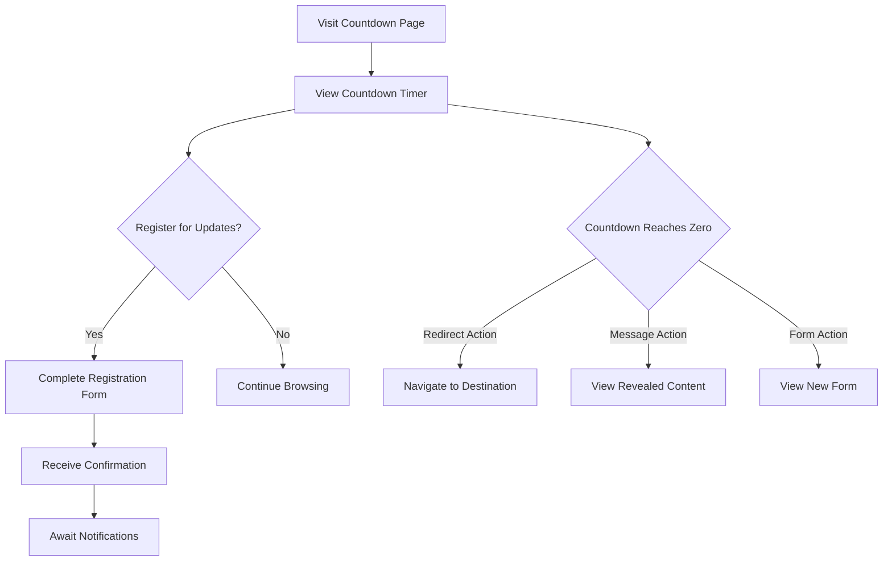

# Temporary Pages Platform: UI/UX Specification

## Overview

This document outlines the user interface design principles, component specifications, and user experience flows for the Temporary Pages Platform. It serves as a reference for designers and developers to ensure consistent implementation of the platform's visual language and interaction patterns.

## Design System

### Brand Identity

- **Primary Colors**:
  - Primary Blue: `#3B82F6` (for CTAs, links, and highlights)
  - Secondary Teal: `#10B981` (for success states and confirmations)
  - Accent Pink: `#EC4899` (for attention-grabbing elements)

- **Neutral Colors**:
  - Background: `#F9FAFB`
  - Surface: `#FFFFFF`
  - Text Primary: `#111827`
  - Text Secondary: `#6B7280`
  - Border: `#E5E7EB`

- **Typography**:
  - Primary Font: Inter (for UI elements and body text)
  - Secondary Font: Montserrat (for headings and promotional text)
  - Monospace: JetBrains Mono (for code or technical information)

- **Spacing System**: 
  - Based on 4px increments: 4px, 8px, 16px, 24px, 32px, 48px, 64px

### Component Library (Shadcn UI)

The platform uses Shadcn UI as its component library foundation with the following customizations:

#### Button Variants
- **Primary**: High-emphasis actions
- **Secondary**: Medium-emphasis actions
- **Outline**: Low-emphasis actions
- **Ghost**: Minimal visual interference
- **Destructive**: For delete or irreversible actions

```tsx
// Button component example
<Button variant="primary" size="md">
  Create Sales Page
</Button>
```

#### Form Components
- Text inputs with floating labels
- Form validation with inline error messages
- Toggles and switches for boolean options
- Date/time pickers for expiration settings

#### Cards & Containers
- Product cards with hover states
- Sales page containers with customizable headers
- Dashboard metric cards with visual indicators

#### Feedback Components
- Toast notifications for non-blocking feedback
- Modal dialogs for important decisions
- Progress indicators for file uploads
- Loading states for async operations

## User Interfaces

### Temporary Page Type Interfaces

#### 1. Countdown Landing Page


**Key Elements**:
- Hero section with compelling headline and subheading
- Large, prominent countdown timer synchronized with server time
- Optional email/SMS capture form with minimal fields
- Clear messaging about what happens when the countdown ends
- Strong visual hierarchy focusing on the countdown and call-to-action
- Optional background video or animated elements for engagement

**States**:
- Active: Shows countdown and registration form
- Zero Reached: Displays configured post-countdown content (message, redirect, or new form)
- Expired: If accessed after the countdown period has fully ended

**Mobile Optimization**:
- Full-screen countdown on initial load
- Sticky form that remains visible during scroll
- Touch-friendly input fields and buttons

#### 2. Flash Sale Page


**Key Elements**:
- Sale announcement banner with countdown timer
- Product grid or featured product display
- Original and discounted price comparison
- Product details with rich media support
- Urgency indicators (e.g., "only 5 left", "30% sold")
- Add to cart and quick checkout options
- Trust badges and security indicators

**States**:
- Active: Full sale experience with live countdown
- Ending Soon: Enhanced urgency UI elements when <1 hour remains
- Expired: "Sale Ended" messaging with alternative actions
- Sold Out: Displays when inventory is depleted before time expires

**Special Features**:
- Real-time inventory updates
- Price strike-through animation
- Micro-animations for urgency (pulsing timer, etc.)
- Social proof notifications ("X people purchased this")

#### 3. Event Registration Page


**Key Elements**:
- Event banner with date, time, and type (virtual/physical)
- Compelling event description and agenda
- Speaker/host information with credentials
- Registration form with customizable fields
- Countdown to registration deadline
- Capacity indicators (e.g., "85% full")
- Event location details or virtual attendance information

**States**:
- Open Registration: Standard registration experience
- Limited Spots: Enhanced urgency UI when capacity is nearly reached
- Waitlist Mode: When capacity is reached but waitlist is enabled
- Registration Closed: When deadline has passed
- Post-Event: After event has concluded

**Registration Form Components**:
- Progressive disclosure for optional fields
- Real-time field validation
- Multi-step form for complex registrations
- Payment integration for paid events

#### 4. Limited-Time Offer Page


**Key Elements**:
- Headline emphasizing exclusivity and limited availability
- Clear offer details and benefits
- Prominent discount code in copy-to-clipboard format
- Countdown timer to offer expiration
- Visual representation of the offer (product image, bonus content preview)
- Strong call-to-action to redeem offer
- Social sharing options to extend reach

**States**:
- Active: Full offer details with live countdown
- Almost Expired: Enhanced urgency UI when <1 hour remains
- Expired: "Offer Ended" messaging with alternative actions
- Limited Quantity Reached: When quantity limit is reached before time expires

**Interactions**:
- Discount code copying with visual feedback
- Click-to-redeem buttons for direct application
- Animated reveal of bonus content previews
- Confetti animation on successful redemption

### User Management Console

#### 1. Dashboard Overview

**Key Elements**:

*   Summary metrics by page type (active pages, conversion rates, etc.)
*   Quick action buttons for creating new pages
*   Recent activity feed (new registrations, sales, etc.)
*   Performance overview charts
*   Upcoming expirations and launches
*   **Organization and Subscription Status**

**Organization**:

*   Tab/filter system to view metrics by page type
*   Date range selector for historical data
*   Saved views for frequently accessed metrics
*   Export functionality for reports
*   **Organization and User Management Section**

#### 2. Page Type Selector

**Key Elements**:
- Visual cards representing each page type
- Brief description of each page's purpose
- Recommended use cases
- Quick-start templates
- Preview thumbnails of example pages

**Organization**:
- Grid layout for desktop
- Carousel for mobile devices
- Search/filter by goal (collect leads, sell products, etc.)
- Sorting by popularity or relevance

#### 3. Page Builder Interface

**Common Elements Across Page Types**:

*   Page title and URL configuration
*   Launch and expiration settings
*   Design customization (colors, fonts, images)
*   SEO metadata configuration
*   Tracking and analytics integration
*   Product selection and association (for product-based pages)
*   **Organization and Group Assignment**

**Type-Specific Builders**:

**Countdown Builder**:
- Date/time picker for countdown target
- Post-countdown action selector
- Registration form builder
- Notification message configuration

**Flash Sale Builder**:
- Product selector/uploader
- Product display configuration
- Pricing and discount configuration
- Inventory management
- Sale duration settings

**Event Registration Builder**:
- Event details configuration
- Registration form builder
- Capacity and waitlist settings
- Event reminder configuration

**Limited Offer Builder**:
- Offer details and description
- Discount code generation
- Quantity limitation settings
- Offer duration configuration

#### 4. Analytics & Reporting by Page Type

**Countdown Analytics**:
- View/visitor count
- Registration conversion rate
- Registration source breakdown
- Engagement time metrics

**Flash Sale Analytics**:
- Sales volume and revenue
- Conversion rate by product
- Cart abandonment rate
- Average order value

**Event Registration Analytics**:
- Registration counts and conversion rate
- Attendance prediction
- Waitlist conversion rate
- Registration source breakdown

**Limited Offer Analytics**:
- Offer view count
- Discount code usage rate
- Conversion path analysis
- Referral source breakdown

## User Flows

### Visitor Experience Flows

#### Countdown Landing Page Flow



#### Flash Sale Page Flow

```mermaid
graph TD
    A[Visit Flash Sale Page] --> B{Is Sale Active?}
    B -- Yes --> C[Browse Products]
    B -- No --> D[See "Sale Ended" Page]
    C --> E[View Product Details]
    E --> F[Add to Cart]
    F --> G{Continue Shopping?}
    G -- Yes --> C
    G -- No --> H[Proceed to Checkout]
    H --> I[Complete Stripe Payment]
    I -- Success --> J[Access Digital Products]
    I -- Failure --> K[Return to Checkout]
```

#### Event Registration Flow

```mermaid
graph TD
    A[Visit Event Page] --> B{Registration Open?}
    B -- Yes --> C[View Event Details]
    B -- No --> D[See "Registration Closed"]
    C --> E{Register for Event?}
    E -- Yes --> F[Complete Registration Form]
    E -- No --> G[Exit Page]
    F --> H[Process Registration]
    H -- Free Event --> I[Receive Confirmation]
    H -- Paid Event --> J[Complete Payment]
    J --> I
    I --> K[Receive Event Reminders]
    K --> L[Attend Event]
```

#### Limited-Time Offer Flow

```mermaid
graph TD
    A[Visit Offer Page] --> B{Is Offer Active?}
    B -- Yes --> C[View Offer Details]
    B -- No --> D[See "Offer Expired" Page]
    C --> E[Copy Discount Code]
    E --> F{Redeem Now?}
    F -- Yes --> G[Navigate to Redemption Site]
    F -- No --> H[Save for Later]
    G --> I[Apply Discount Code]
    I --> J[Complete Purchase]
```

### User Management Flows

#### Page Creation Flow

```mermaid
graph TD
    A[Access Console] --> B[Select "Create Page"]
    B --> C[Choose Page Type]
    C --> D[Configure Basic Settings]
    D --> E[Design Page Content]
    E --> F1{Is Product-Based Page?}
    F1 -- Yes --> F2[Select Products]
    F2 --> F3[Configure Product Display]
    F3 --> G
    F1 -- No --> G[Set Timing Parameters]
    G --> H[Configure Follow-up Actions]
    H --> I[Preview Page]
    I -- Approved --> J[Publish Page]
    I -- Needs Changes --> E
    J --> K[Copy Shareable URL]
    K --> L[Monitor Performance]
```

#### Organization Management Flow

```mermaid
graph TD
    A[Access Console] --> B[Select "Organization Settings"]
    B --> C[View Organization Details]
    C --> D{Edit Organization?}
    D -- Yes --> E[Modify Organization Details]
    E --> F[Save Changes]
    D -- No --> G[Return to Dashboard]
```

#### User and Role Management Flow

```mermaid
graph TD
    A[Access Console] --> B[Select "User Management"]
    B --> C[View User List]
    C --> D{Add New User?}
    D -- Yes --> E[Enter User Details]
    E --> F[Assign Role]
    F --> G[Save User]
    D -- No --> H{Edit User?}
    H -- Yes --> I[Modify User Details]
    I --> J[Save Changes]
    H -- No --> K[Return to User List]
```

#### Subscription Management Flow

```mermaid
graph TD
    A[Access Console] --> B[Select "Subscription"]
    B --> C[View Current Plan]
    C --> D{Change Plan?}
    D -- Yes --> E[Select New Plan]
    E --> F[Confirm Subscription Change]
    D -- No --> G[Return to Dashboard]
```

## Accessibility Standards

### WCAG 2.1 AA Compliance

- **Perceivable**:
  - Alt text for all images
  - Minimum contrast ratio of 4.5:1
  - Content remains accessible when zoomed to 200%
  - Multiple ways to access content

- **Operable**:
  - All functionality available via keyboard
  - No content that flashes more than 3 times per second
  - Skip navigation links for screen readers
  - Clear page titles and headings

- **Understandable**:
  - Consistent navigation and identification
  - Error identification and suggestions
  - Labels and instructions for forms

- **Robust**:
  - Valid HTML that works with assistive technologies
  - ARIA landmarks and roles where appropriate
  - Focus management for single-page application

## Interaction Design Principles

### Feedback & Affordance

- **Visible System Status**: Always communicate the current state (loading, processing, success, error)
- **Clear Affordances**: Make interactive elements visually distinct
- **Response Times**: Acknowledge user input within 100ms, complete actions within 1000ms where possible
- **Microcopy**: Use clear, concise language for instructions and feedback

### Progressive Disclosure

- Present only essential information and controls initially
- Reveal additional options as needed based on user actions
- Use expandable sections for detailed information
- Implement step-by-step processes for complex tasks

### Mobile-First Approach

- Design core experiences for mobile devices first
- Enhance experiences for larger screens through progressive enhancement
- Ensure touch targets are at least 44x44 pixels
- Implement appropriate gestures for mobile interactions

## Performance Guidelines

### Loading States

- **Initial Page Load**: Skeleton screens instead of spinners
- **Action Feedback**: Button loading states
- **Optimistic UI**: Show expected UI state before server confirmation

### Perceived Performance

- Time to First Meaningful Paint < 1.5s
- Time to Interactive < 3.0s
- Layout shifts minimized (CLS < 0.1)
- Prefetch resources for likely user paths

## Testing & Validation Methods

### Usability Testing Protocol

- Task-based scenarios for core user flows
- Think-aloud sessions for qualitative feedback
- Success metrics: completion rate, time on task, error rate
- Satisfaction measures: SUS score, custom satisfaction questions

### A/B Testing Framework

- Primary conversion metrics: purchase rate, registration rate
- Secondary metrics: engagement time, repeat visits
- Minimum sample size calculations based on expected effect size
- Statistical significance threshold of p < 0.05

## Implementation Guidelines

### Component Development Process

1. Design in Figma with component variants
2. Document props, states, and accessibility requirements
3. Implement in Shadcn UI with TypeScript
4. Review for accessibility and responsive behavior
5. Document usage examples in Storybook

### Responsive Breakpoints

- **Mobile**: < 640px
- **Tablet**: 640px - 1024px
- **Desktop**: > 1024px
- **Large Desktop**: > 1440px

### Animation Standards

- Use CSS transitions for simple state changes
- Use Framer Motion for complex animations
- Respect reduced motion preferences
- Keep animations under 300ms for UI responses
- Ensure animations don't block user interaction

## Documentation & Updates

- Component library maintained in Storybook
- Design tokens documented in theme specification
- Regular audits for accessibility and performance
- Version control for design assets in Figma
- Changelog for significant UI/UX updates

## Role-Based Access Control (RBAC) in UI

The UI reflects RBAC by:

*   **Hiding or disabling features based on the user's role.**
*   **Displaying different levels of access to data based on the user's role.**
*   **Providing specific dashboards and reports tailored to each role.**
*   **Restricting access to organization and user management functions based on role.**