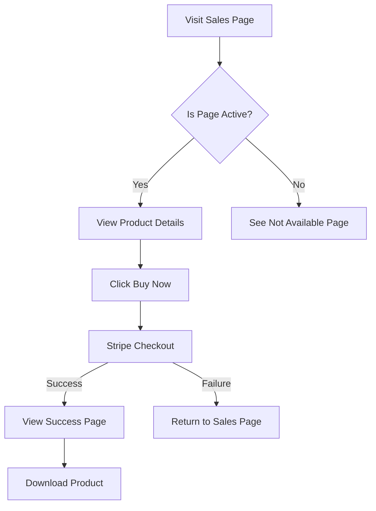
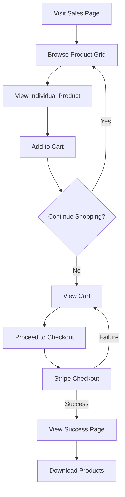
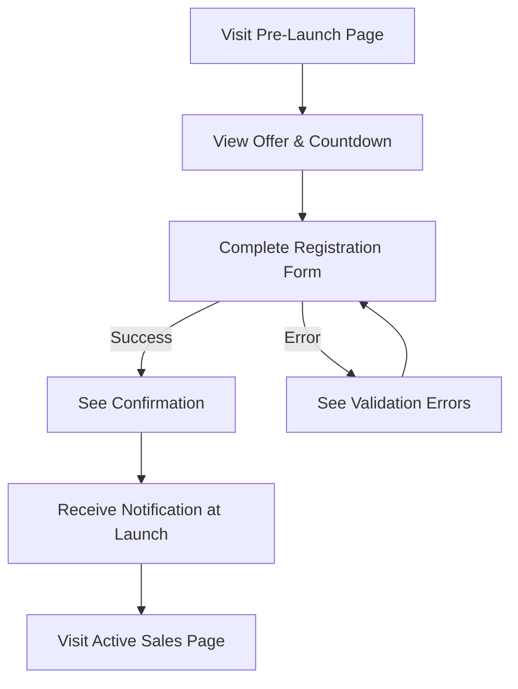
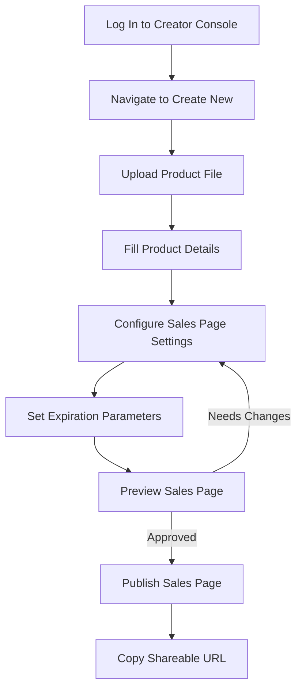
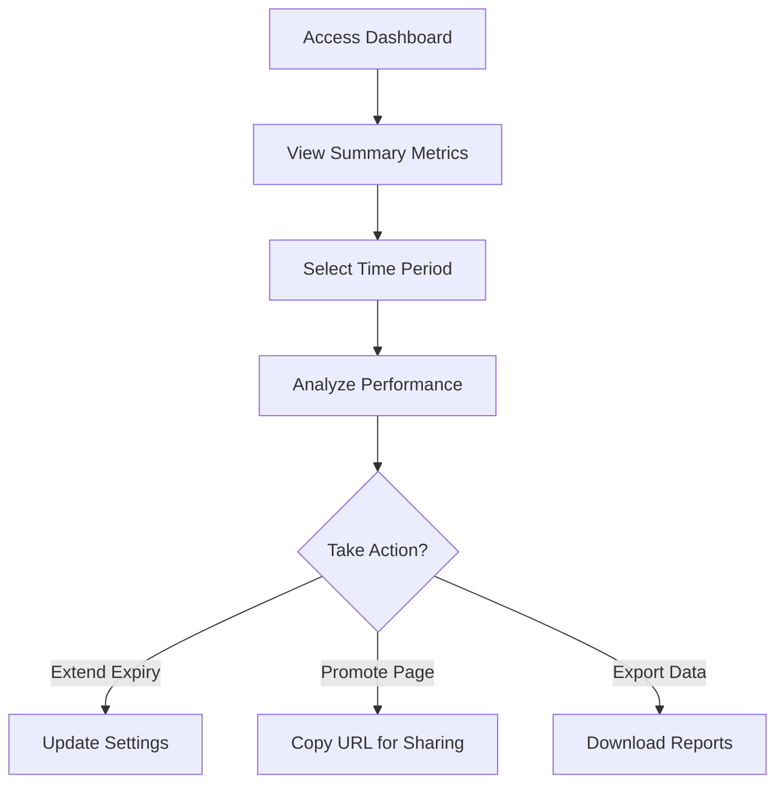

# Temporary Pages Platform: UI/UX Specification

## Overview

This document outlines the user interface design principles, component specifications, and user experience flows for the Temporary Pages Platform. It serves as a reference for designers and developers to ensure consistent implementation of the platform's visual language and interaction patterns.

## Design System

### Brand Identity

- **Primary Colors**:
  - Primary Blue: `#3B82F6` (for CTAs, links, and highlights)
  - Secondary Teal: `#10B981` (for success states and confirmations)
  - Accent Pink: `#EC4899` (for attention-grabbing elements)

- **Neutral Colors**:
  - Background: `#F9FAFB`
  - Surface: `#FFFFFF`
  - Text Primary: `#111827`
  - Text Secondary: `#6B7280`
  - Border: `#E5E7EB`

- **Typography**:
  - Primary Font: Inter (for UI elements and body text)
  - Secondary Font: Montserrat (for headings and promotional text)
  - Monospace: JetBrains Mono (for code or technical information)

- **Spacing System**: 
  - Based on 4px increments: 4px, 8px, 16px, 24px, 32px, 48px, 64px

### Component Library (Shadcn UI)

The platform uses Shadcn UI as its component library foundation with the following customizations:

#### Button Variants
- **Primary**: High-emphasis actions
- **Secondary**: Medium-emphasis actions
- **Outline**: Low-emphasis actions
- **Ghost**: Minimal visual interference
- **Destructive**: For delete or irreversible actions

```tsx
// Button component example
<Button variant="primary" size="md">
  Create Sales Page
</Button>
```

#### Form Components
- Text inputs with floating labels
- Form validation with inline error messages
- Toggles and switches for boolean options
- Date/time pickers for expiration settings

#### Cards & Containers
- Product cards with hover states
- Sales page containers with customizable headers
- Dashboard metric cards with visual indicators

#### Feedback Components
- Toast notifications for non-blocking feedback
- Modal dialogs for important decisions
- Progress indicators for file uploads
- Loading states for async operations

## User Interfaces

### Customer-Facing Interfaces

#### 1. Sales Page


**Key Elements**:
- Hero section with product name and description
- Prominent countdown timer showing time remaining
- Product details section with rich media support
- Clear pricing information
- Prominent "Buy Now" CTA
- Trust indicators (secure payment, money-back guarantee)
- Optional social proof elements

**Responsive Behavior**:
- Desktop: Two-column layout with product details on left, purchase info on right
- Tablet: Stacked layout with purchase info below product details
- Mobile: Full-width elements with optimized touch targets

#### 2. Pre-Launch Registration Page

**Key Elements**:
- Compelling headline and value proposition
- Prominent countdown to launch date
- Email capture form (minimal friction)
- Benefits of registering early
- Optional lead magnet offer
- Social sharing buttons

**States**:
- Initial state: Registration form visible
- Success state: Confirmation message with share prompts
- Error state: Validation errors with clear resolution guidance

#### 3. Multi-Item Product Grid

**Key Elements**:
- Grid of product cards (3 columns on desktop, 2 on tablet, 1 on mobile)
- Product thumbnail images
- Product name, brief description, and price
- Individual "Add to Cart" buttons
- Shared countdown timer for the entire page

**Interactions**:
- Hover states with subtle elevation change
- Click to view detailed product page
- Quick-add to cart functionality

#### 4. Checkout Flow

**Stages**:
1. Cart review with item details
2. Shipping information (if physical products)
3. Payment details via Stripe Elements
4. Order confirmation

**Principles**:
- Minimize form fields to reduce friction
- Clear progress indicators
- Persistent order summary
- Secure payment indicators

#### 5. Success Page

**Key Elements**:
- Order confirmation message
- Order summary
- Download button(s) for digital products
- Countdown to link expiration
- Share options and referral incentives
- Related products (if applicable)

#### 6. Expired/Not Available Pages

**Expired Page**:
- Clear messaging about content expiration
- Optional contact form for inquiries
- Related creator content (if available)

**Not Yet Available Page**:
- Coming soon messaging
- Countdown to availability
- Pre-registration option
- Clear next steps for the visitor

### Creator Console Interfaces

#### 1. Dashboard Overview

**Key Elements**:
- Summary metrics (active sales pages, total sales, conversion rate)
- Recent sales activity
- Expiring content alerts
- Quick action buttons for common tasks
- Performance trends charts

**Personalization**:
- Configurable widgets and metric cards
- Customizable date ranges for analytics
- Saved filters and views

#### 2. Product Management

**Key Elements**:
- Tabular list of products with key metadata
- Search and filter capabilities
- Bulk action tools
- Quick edit functionality
- Status indicators (active, expired, scheduled)

**CRUD Operations**:
- Create: Multi-step form with progress indicator
- Read: Detailed view with all product information
- Update: Inline editing for quick changes, modal for complex edits
- Delete: Confirmation dialog with clear consequences

#### 3. Sales Page Builder

**Key Elements**:
- Visual editor for page layout
- Theme selection and customization
- Content blocks for different media types
- Preview mode with device simulation
- Publishing controls with scheduling options

**Customization Options**:
- Color scheme adjustments
- Typography selection
- Layout templates
- Custom CSS injection (advanced mode)

#### 4. Analytics & Reporting

**Key Metrics**:
- Page views and unique visitors
- Conversion rate and funnel performance
- Average order value
- Registration to purchase rate
- Geographic and device distribution

**Visualization**:
- Time-series charts for trend analysis
- Funnel visualization for conversion paths
- Heatmaps for engagement analysis
- Exportable reports in multiple formats

## User Flows

### Customer Experience Flows

#### Single Product Purchase Flow



#### Multi-Product Purchase Flow



#### Pre-Launch Registration Flow



### Creator Experience Flows

#### Sales Page Creation Flow



#### Analytics Review Flow



## Accessibility Standards

### WCAG 2.1 AA Compliance

- **Perceivable**:
  - Alt text for all images
  - Minimum contrast ratio of 4.5:1
  - Content remains accessible when zoomed to 200%
  - Multiple ways to access content

- **Operable**:
  - All functionality available via keyboard
  - No content that flashes more than 3 times per second
  - Skip navigation links for screen readers
  - Clear page titles and headings

- **Understandable**:
  - Consistent navigation and identification
  - Error identification and suggestions
  - Labels and instructions for forms

- **Robust**:
  - Valid HTML that works with assistive technologies
  - ARIA landmarks and roles where appropriate
  - Focus management for single-page application

## Interaction Design Principles

### Feedback & Affordance

- **Visible System Status**: Always communicate the current state (loading, processing, success, error)
- **Clear Affordances**: Make interactive elements visually distinct
- **Response Times**: Acknowledge user input within 100ms, complete actions within 1000ms where possible
- **Microcopy**: Use clear, concise language for instructions and feedback

### Progressive Disclosure

- Present only essential information and controls initially
- Reveal additional options as needed based on user actions
- Use expandable sections for detailed information
- Implement step-by-step processes for complex tasks

### Mobile-First Approach

- Design core experiences for mobile devices first
- Enhance experiences for larger screens through progressive enhancement
- Ensure touch targets are at least 44x44 pixels
- Implement appropriate gestures for mobile interactions

## Performance Guidelines

### Loading States

- **Initial Page Load**: Skeleton screens instead of spinners
- **Action Feedback**: Button loading states
- **Optimistic UI**: Show expected UI state before server confirmation

### Perceived Performance

- Time to First Meaningful Paint < 1.5s
- Time to Interactive < 3.0s
- Layout shifts minimized (CLS < 0.1)
- Prefetch resources for likely user paths

## Testing & Validation Methods

### Usability Testing Protocol

- Task-based scenarios for core user flows
- Think-aloud sessions for qualitative feedback
- Success metrics: completion rate, time on task, error rate
- Satisfaction measures: SUS score, custom satisfaction questions

### A/B Testing Framework

- Primary conversion metrics: purchase rate, registration rate
- Secondary metrics: engagement time, repeat visits
- Minimum sample size calculations based on expected effect size
- Statistical significance threshold of p < 0.05

## Implementation Guidelines

### Component Development Process

1. Design in Figma with component variants
2. Document props, states, and accessibility requirements
3. Implement in Shadcn UI with TypeScript
4. Review for accessibility and responsive behavior
5. Document usage examples in Storybook

### Responsive Breakpoints

- **Mobile**: < 640px
- **Tablet**: 640px - 1024px
- **Desktop**: > 1024px
- **Large Desktop**: > 1440px

### Animation Standards

- Use CSS transitions for simple state changes
- Use Framer Motion for complex animations
- Respect reduced motion preferences
- Keep animations under 300ms for UI responses
- Ensure animations don't block user interaction

## Documentation & Updates

- Component library maintained in Storybook
- Design tokens documented in theme specification
- Regular audits for accessibility and performance
- Version control for design assets in Figma
- Changelog for significant UI/UX updates